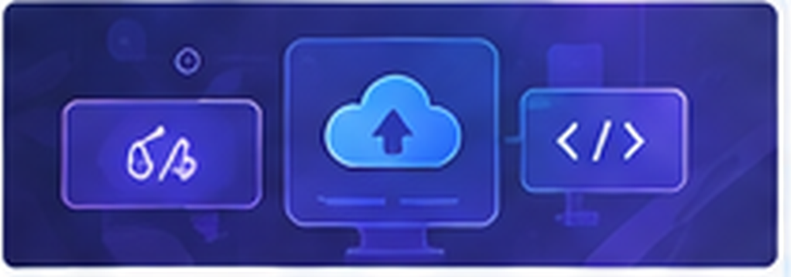

<div align="center">


# 👋 Hi, I'm Pournima Tele

### Senior Software Engineer · AI-Driven Development · QA Automation · Prompt Engineering

14+ years in Quality Engineering, Test Automation & Software Engineering — building AI-powered testing solutions, automation frameworks and engineering workflows.

<p>
  <a href="https://www.linkedin.com/in/pournimatele"></a>
  <a href="https://github.com/QAPournima/Portfolio"></a>
  <a href="https://github.com/QAPournima"></a>
</p>

</div>

---

## About Me

Senior Software Engineer with **14+ years** across Quality Engineering, Test Automation and hands-on software development.

I built my career in Quality Engineering — including QA leadership — then deliberately moved back into a **hands-on IC role** to go deeper into AI-driven development, prompt engineering, AI/LLM testing and modern engineering practice.

I work at the intersection of:

- AI-driven software development and prompt engineering
- AI / LLM testing, AI agents and guardrail evaluation
- Test automation across web, mobile and APIs
- Backend and frontend engineering
- CI/CD, observability and engineering productivity

> I use AI coding agents such as Claude and Cursor as engineering collaborators, while applying strong QA thinking to challenge, test and refine what AI produces.

---

## AI-Driven Engineering Workflow

```text
Requirements
     ↓
Understand & Analyse
     ↓
Prompt / Context Engineering
     ↓
AI-assisted Implementation
     ↓
Test & Validate
     ↓
Debug / Refine
     ↓
Code Review
     ↓
Merge & Deliver
```

AI is used to accelerate engineering. The output is still validated with engineering and QA principles — not treated as automatically correct.

---

## Featured AI & Automation Projects

<table>
<tr>
<td width="50%" valign="top">


### AI Testing Automation Platform

AI-driven QA ecosystem spanning **Web, Mobile and API testing**.

- AI test generation
- Intelligent bug analysis
- Voice-enabled QA agent
- Jira-integrated QA assistant
- AI exploratory testing
- Risk-based testing
- AI-driven chaos testing

`Python` `Flask` `Playwright` `OpenAI` `Gemini` `Jira`

[View Project](https://github.com/QAPournima/Zap-Prototype)

</td>
<td width="50%" valign="top">


### GenQA AI Agent

AI assistant for testers that helps create, validate and update test cases and QA artefacts.

`Python` `Playwright` `LLMs` `Jira` `Automation`

<em>Internal / Private Project</em>

</td>
</tr>
<tr>
<td width="50%" valign="top">


### Playwright / AI Automation

Modern browser automation combined with AI-assisted engineering workflows.

`Playwright` `JavaScript/TypeScript` `GitHub Actions` `Docker`

[View Project](https://github.com/QAPournima/playwrightWithJavascript)

</td>
<td width="50%" valign="top">


### Mobile Automation — Appium + Maestro

Mobile E2E across **iOS and Android**, including Appium, Maestro and AI-assisted mobile automation.

`Java` `Appium` `Maestro` `Jenkins` `Docker`

[View Project](https://github.com/QAPournima/QAAutomationTest_Mobile)

</td>
</tr>
<tr>
<td width="50%" valign="top">



### API & Backend Automation

REST API automation, integration testing, backend validation, SQL and MongoDB.

`Java` `REST-assured` `Postman` `SQL` `MongoDB`

<em>Internal / Private Project</em>

</td>
<td width="50%" valign="top">


### LLM / Conversational AI Testing

Intent recognition, multi-turn conversations, response accuracy, edge cases, adversarial inputs, guardrails, prompt injection, hallucination detection and non-deterministic output evaluation.

`Python` `LLMs` `NLP` `Jira` `TestNG`

<em>Internal / Private Project</em>

</td>
</tr>
</table>

---

## AI + QA Capabilities

<table>
<tr>
<td align="center" width="25%">
<br/>
<strong>AI Test Generation</strong>
</td>
<td align="center" width="25%">
<br/>
<strong>Intelligent Bug Analysis</strong>
</td>
<td align="center" width="25%">
<br/>
<strong>AI Agent Workflows</strong>
</td>
<td align="center" width="25%">
<br/>
<strong>LLM Testing</strong>
</td>
</tr>
<tr>
<td align="center">
<strong>Conversational AI Testing</strong>
</td>
<td align="center">
<strong>Voice Agent Testing</strong>
</td>
<td align="center">
<strong>Risk-Based Testing</strong>
</td>
<td align="center">
<strong>Prompt Engineering</strong>
</td>
</tr>
<tr>
<td align="center">
<strong>Guardrail Testing</strong>
</td>
<td align="center">
<strong>Prompt-Injection Testing</strong>
</td>
<td align="center">
<strong>Hallucination Detection</strong>
</td>
<td align="center">
<strong>AI Exploratory Testing</strong>
</td>
</tr>
</table>

---

## Technology Stack

**AI & LLM**


**Languages & Development**


**Automation**


**DevOps & Engineering**


**Quality & Observability**


---

## GitHub Activity

<p align="center">
  
  
</p>

<p align="center">
  
</p>

---

## Career Snapshot

| Focus | Detail |
| --- | --- |
| **14+ years** | Quality Engineering, Test Automation and Software Engineering |
| **AI engineering** | AI agents, LLM workflows, prompt engineering and AI testing |
| **Automation** | Web, mobile, API and AI-powered automation |
| **Engineering** | Python, Java, Flask, Playwright, APIs, Docker and CI/CD |
| **Leadership** | QA leadership, mentoring, stakeholder management and delivery |
| **Domains** | Telecom, cloud calling, CRM, ride hailing, e-commerce, payroll and travel |

---

## Certifications

`ISTQB` · `CSM` · `PRINCE2` · `PMP` · `CAT` · `CSTM`

---

## Writing & Knowledge Sharing

I write about Quality Engineering, test automation and AI-driven testing.

- [The Role of QA in an Agile Scrum Team](https://medium.com/@qapournima/the-role-of-qa-in-an-agile-scrum-team-navigating-the-product-life-cycle-02fdffd3c4f1)
- [Understanding Shift-Left Testing](https://medium.com/@qapournima/understanding-shift-left-testing-a-comprehensive-guide-92a62360edb1)
- [AI-Driven Testing](https://medium.com/@qapournima/ai-driven-testing-revolutionizing-software-testing-with-automation-and-efficiency-4b5308362560)
- [Breaking Silos in Agile Teams](https://medium.com/@qapournima/breaking-silos-in-agile-teams-fostering-collaboration-and-alignment-863f5aea3f2c)

**Book:** [The Last Line of Defense — By QA](https://simplebooklet.com/thelastlineofdefensebyqa#page=1)

---

## Currently Exploring

`AI Agents` · `LLM Engineering` · `Prompt Engineering` · `AI / LLM Testing` · `Python` · `Backend Development` · `Cloud & DevOps` · `Observability` · `Engineering Productivity`

---

## Let's Connect

<p align="center">
  <a href="https://www.linkedin.com/in/pournimatele"></a>
  <a href="https://github.com/QAPournima/Portfolio"></a>
  <a href="https://pournimacsm.wixsite.com/qapournima"></a>
</p>

<p align="center"><strong>Building with AI. Testing with intelligence. Engineering for quality.</strong></p>
