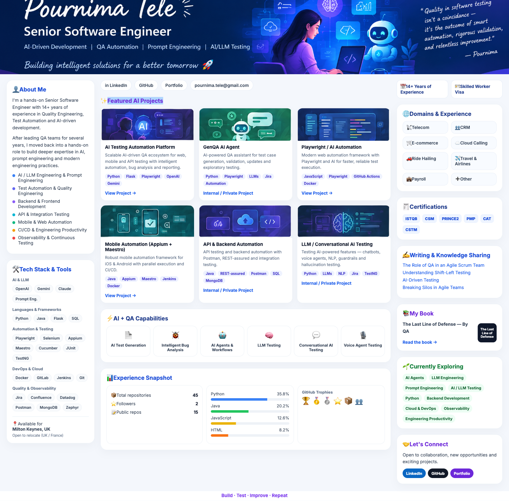

  

  
  
  
  

  <a href="https://github.com/QAPournima/Zap-Prototype">AI Testing Platform</a>
  ·
  <a href="https://github.com/QAPournima/playwrightWithJavascript">Playwright / AI Automation</a>
  ·
  <a href="https://github.com/QAPournima/QAAutomationTest_Mobile">Mobile Automation</a>
  ·
  <a href="https://medium.com/@qapournima">Writing</a>
  ·
  <a href="https://simplebooklet.com/thelastlineofdefensebyqa#page=1">Book</a>

