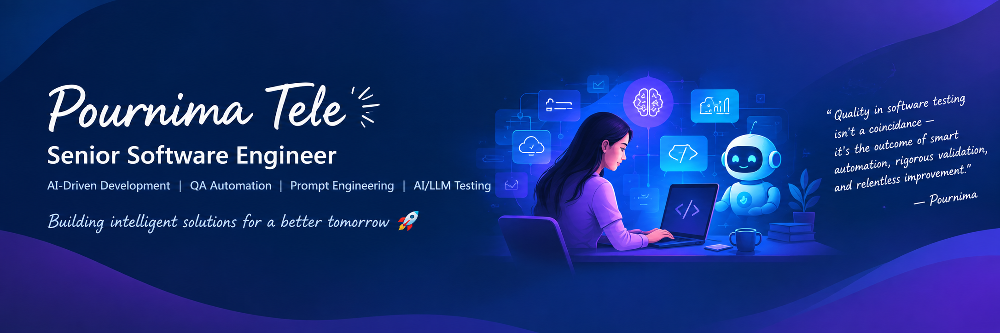
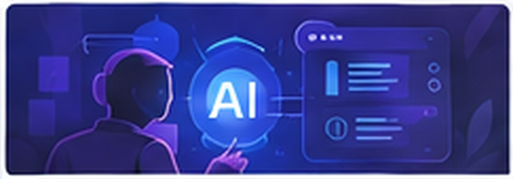

  

 

**Senior Software Engineer · AI-Driven Development · QA Automation · Prompt Engineering**

14+ years in Quality Engineering, Test Automation and Software Engineering.

---

### About Me

Hands-on Senior Software Engineer with a Quality Engineering background. After QA leadership, I moved back into an IC role to go deeper into AI-driven development, prompt engineering, AI/LLM testing and modern engineering.

I use AI coding agents such as Claude, Cursor and **OpenCode (LLMGateway)** as collaborators — then apply QA thinking to challenge, test and refine what they produce.

- AI / LLM engineering, prompt engineering and AI agents
- AI / LLM testing, guardrails and conversational AI
- Web, mobile and API automation
- Backend / frontend development, CI/CD and observability

Milton Keynes, UK · Skilled Worker Visa · Open to relocate (UK / France)

---

### Featured AI/Other Projects

<table>
<tr>
<td width="50%" valign="top">

 
<strong>AI Testing Automation Platform</strong> 
AI-driven QA ecosystem across web, mobile and API testing. 
<code>Python</code> <code>Flask</code> <code>Playwright</code> <code>OpenAI</code> <code>Gemini</code> 
<a href="https://github.com/QAPournima/Zap-Prototype">View project</a>
</td>
<td width="50%" valign="top">

 
<strong>GenQA AI Agent</strong> 
AI assistant that helps create, validate and update test cases. 
<code>Python</code> <code>Playwright</code> <code>LLMs</code> <code>Jira</code> 
<em>Internal / Private Project</em>
</td>
</tr>
<tr>
<td valign="top">

 
<strong>Playwright / AI Automation</strong> 
Modern browser automation with AI-assisted engineering workflows. 
<code>Playwright</code> <code>JavaScript/TypeScript</code> <code>GitHub Actions</code> <code>Docker</code> 
<a href="https://github.com/QAPournima/playwrightWithJavascript">View project</a>
</td>
<td valign="top">

 
<strong>Mobile Automation — Appium + Maestro</strong> 
iOS and Android E2E with Appium, Maestro and CI/CD. 
<code>Java</code> <code>Appium</code> <code>Maestro</code> <code>Jenkins</code> <code>Docker</code> 
<a href="https://github.com/QAPournima/QAAutomationTest_Mobile">View project</a>
</td>
</tr>
<tr>
<td valign="top">

 
<strong>API & Backend Automation</strong> 
REST APIs, integration testing, SQL and MongoDB. 
<code>Java</code> <code>REST-assured</code> <code>Postman</code> <code>SQL</code> <code>MongoDB</code> 
<em>Internal / Private Project</em>
</td>
<td valign="top">

 
<strong>LLM / Conversational AI Testing</strong> 
Guardrails, prompt injection, hallucination detection and multi-turn dialogue. 
<code>Python</code> <code>LLMs</code> <code>NLP</code> <code>Jira</code> <code>TestNG</code> 
<em>Internal / Private Project</em>
</td>
</tr>
</table>

<!-- FEATURED-AUTO:START -->
### More GitHub Projects

<table>
<tr>
<td width="50%" valign="top">
<a href="https://github.com/QAPournima/OpenAI_Test_Case_Generator"><strong>OpenAI Test Case Generator</strong></a> 
This project is a Java-based automation tool that integrates with Jira and OpenAI to ge... <code>Java</code>
</td>
<td width="50%" valign="top">
<a href="https://github.com/QAPournima/Zap-RiskAnalysis-AI-ML"><strong>Zap RiskAnalysis AI ML</strong></a> 
Risk Analysis Dashboard using AI and ML <code>HTML</code>
</td>
</tr>
<tr>
<td width="50%" valign="top">
<a href="https://github.com/QAPournima/ML-Predicting-Bugs"><strong>ML Predicting Bugs</strong></a> 
Predicting High-Risk Bugs with Machine Learning <code>HTML</code>
</td>
<td width="50%" valign="top">
<a href="https://github.com/QAPournima/GraphQL-Mock-Server"><strong>GraphQL Mock Server</strong></a> 
This project is a GraphQL server implementation that utilizes GraphQL Tools to define a... <code>JavaScript</code>
</td>
</tr>
<tr>
<td width="50%" valign="top">
<a href="https://github.com/QAPournima/AI_Meeting_Recorder_App"><strong>AI Meeting Recorder App</strong></a> 
GitHub project <code>Java</code>
</td>
<td width="50%" valign="top">
<a href="https://github.com/QAPournima/cucumber-automation"><strong>cucumber automation</strong></a> 
selenium with maven + Gherkin language +Cucumber + BDD <code>JavaScript</code>
</td>
</tr>
<tr>
<td width="50%" valign="top">
<a href="https://github.com/QAPournima/BDD-Automation"><strong>BDD Automation</strong></a> 
GitHub project <code>Java</code>
</td>
<td></td>
</tr>
</table>
<!-- FEATURED-AUTO:END -->

---

### Tech Stack

**AI & LLM**  

**Languages & Development**  

**Automation**  

**DevOps & Engineering**  

**Quality & Observability**  

---

### AI + QA Capabilities

| | | |
| --- | --- | --- |
| AI Test Generation | Intelligent Bug Analysis | AI Agent Workflows |
| LLM Testing | Conversational AI Testing | Voice Agent Testing |
| Risk-Based Testing | Prompt Engineering | Guardrail Testing |
| Prompt-Injection Testing | Hallucination Detection | OpenCode / LLMGateway |

---

### Experience Snapshot

  
  

**Domains:** Telecom · CRM · Cloud Calling · Ride Hailing · E-commerce · Payroll · Travel & Airlines

**Certifications:** `ISTQB` · `CSM` · `PRINCE2` · `PMP` · `CAT` · `CSTM`

---

### Writing & Knowledge Sharing

- [The Role of QA in an Agile Scrum Team](https://medium.com/@qapournima/the-role-of-qa-in-an-agile-scrum-team-navigating-the-product-life-cycle-02fdffd3c4f1)
- [Understanding Shift-Left Testing](https://medium.com/@qapournima/understanding-shift-left-testing-a-comprehensive-guide-92a62360edb1)
- [AI-Driven Testing](https://medium.com/@qapournima/ai-driven-testing-revolutionizing-software-testing-with-automation-and-efficiency-4b5308362560)
- [Breaking Silos in Agile Teams](https://medium.com/@qapournima/breaking-silos-in-agile-teams-fostering-collaboration-and-alignment-863f5aea3f2c)

**Book:** [The Last Line of Defense — By QA](https://simplebooklet.com/thelastlineofdefensebyqa#page=1)

---

### Currently Exploring

`AI Agents` · `LLM Engineering` · `Prompt Engineering` · `OpenCode / LLMGateway` · `AI / LLM Testing` · `Python` · `Backend` · `Cloud & DevOps` · `Observability`

---

**Let's Connect** — open to collaboration and new opportunities.

<a href="https://www.linkedin.com/in/pournimatele">LinkedIn</a> ·
<a href="https://github.com/QAPournima">GitHub</a> ·
<a href="https://github.com/QAPournima/Portfolio">Portfolio</a> ·
<a href="https://pournimacsm.wixsite.com/qapournima">Website</a>

Build · Test · Improve · Repeat

